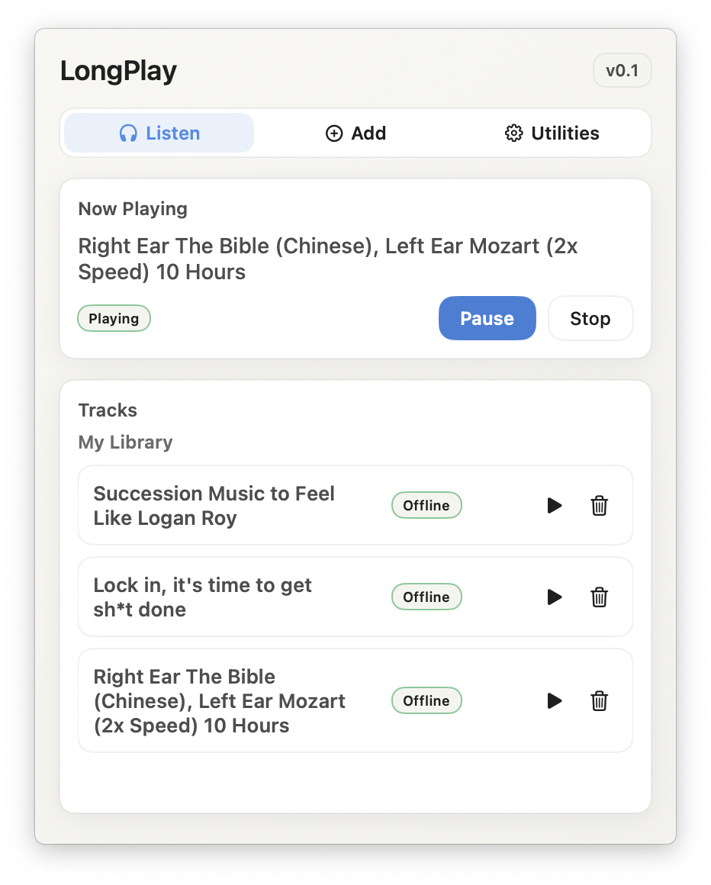

# LongPlay

LongPlay is a lightweight macOS menu bar app for long-form YouTube audio. It downloads audio for reliable playback and resumes where you left off.

## Key Features
- Menu bar only (no Dock icon)
- Download-first playback for long sessions
- Resume per track
- Simple library with search
- Low resource usage

## Screenshot

## Install
Download the latest release from [GitHub Releases](https://github.com/drugoi/longplay-macos/releases) and drag `LongPlay.app` into your Applications folder.

## Issues & Feedback
Please open an issue on [GitHub Issues](https://github.com/drugoi/longplay-macos/issues) and include:
- Your macOS version
- A short description of the problem
- Steps to reproduce (if possible)
